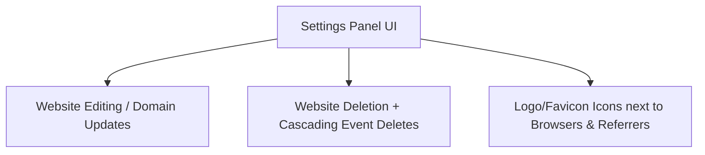

# Privacy Tracker: Repository Audit & Future Roadmap

This document summarizes the current state of **Privacy Tracker** across repository structure, security standards, testing coverage, and operational documentation, and lays out a detailed roadmap for future development.

---

## 🔍 1. Current State Audit

### Codebase & Architecture
*   **Active Tech Stack**: Next.js 16 (App Router), Prisma ORM, SQLite database, Vanilla CSS.
*   **Current State**: High quality, modularized codebase. Custom UTC range bucketing logic has been clean-extracted to `lib/range.ts`. All framework proxies (`proxy.ts`) and boot-time production checks conform to Next.js standards.

### Test Coverage (Issue #12 & #13 Complete)
*   **Test Count**: 36 active tests passing in under 0.5s via `vitest`.
*   **Scope**: Full coverage on UTC time offset bucketing, cookie configuration parsing, JWT crypt roundtrips, API collect header anti-spoofing logic, and SQLite pruning utility.

### Operations & CI (Issue #11 Complete)
*   **Vulnerabilities**: `npm audit` reports **0 vulnerabilities**.
*   **Docker Container**: Fully operational multi-stage Docker build verified locally and deployed with database migrations executed at runtime (`docker-entrypoint.sh`).
*   **CI Pipeline**: Configured GitHub Actions (`ci.yml`) to compile, lint, run test coverage suites, build the Docker container, and run a port-bound container smoke test.

### Documentation
*   Fully complete docs including:
    *   [ARCHITECTURE.md](file:///d:/Projects/trackmeprivately/docs/ARCHITECTURE.md) (Ephemereal session calculations & security)
    *   [PRIVACY.md](file:///d:/Projects/trackmeprivately/docs/PRIVACY.md) (Cookie-free statement guidance)
    *   [DOCKER.md](file:///d:/Projects/trackmeprivately/docs/DOCKER.md) & [DEPLOYMENT.md](file:///d:/Projects/trackmeprivately/docs/DEPLOYMENT.md) (Infrastructure guidelines)
    *   [RETENTION.md](file:///d:/Projects/trackmeprivately/docs/RETENTION.md) (Configuring cron and vacuum space optimizations)

---

## 🗺️ 2. Proposed Future Roadmap

Since all initial milestones (Milestone 1, Milestone 2, and the Stabilization Sprints) are complete, we propose moving into the next phases of product maturity:

### 📋 Milestone 3: UI Settings Panel & Polish (Usability & Reporting)

Currently, the application allows adding websites but has no mechanism to delete, modify, or view code snippets for them without directly editing SQLite.

*   **Website Deletion**:
    *   Add Server Actions to delete a website entry.
    *   Enable cascading deletes to clean up associated `Event` rows.
*   **Website Settings Modal**:
    *   Provide inline editing for website names and target domains.
    *   Display the exact `<script>` tracking snippet containing the site's unique UUID.
*   **Visual Polish**:
    *   Parse and display brand logos/favicons next to referrers (e.g. Google, GitHub, Twitter/X, LinkedIn) and OS/browser names (e.g. Chrome, Safari, Windows, macOS, Android).
*   **CSV/JSON Data Export**:
    *   Allow operators to export tracked website data as a report.

---

### 🛡️ Milestone 4: Scaling & WAL Mode Tuning (High Traffic Production)

SQLite is extremely fast but defaults to rollback-journal mode, which locks the entire database file during writes (blocking dashboard reads).

*   **SQLite WAL (Write-Ahead Logging)**:
    *   Configure SQLite to WAL mode inside the startup entrypoint: `PRAGMA journal_mode=WAL;`.
    *   This permits concurrent reads while writes are occurring, allowing `/api/collect` hits to occur simultaneously with active dashboard queries.
*   **Rate Limiting**:
    *   Implement basic API rate-limiting on `/api/collect` to protect self-hosted SQLite instances from spamming attacks.
*   **DB Seed Scripts**:
    *   Extend database seeds to generate realistic test data patterns across several websites to make local dashboard optimization easier.
