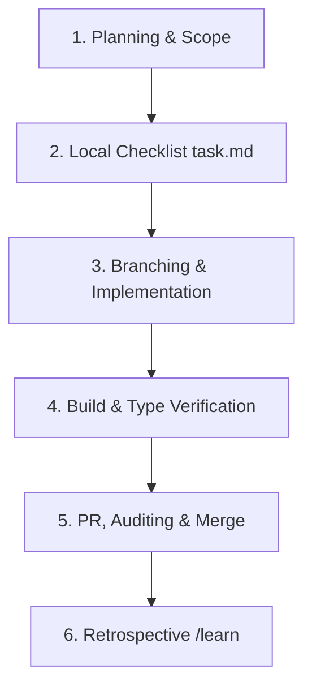

# Sprint & Development Workflow

This document outlines the sprint process, testing strategies, and pre-flight guidelines for developers and AI coding agents contributing to **Privacy Tracker**.

---

## 🔄 The Sprint Cycle

We manage features in structured "sprints" or "milestones" mapped to the GitHub Project board. Each cycle follows these steps:



### 1. Planning & Scope
*   Review the **[GitHub Projects Kanban](https://github.com/users/pinksnafu/projects/1)**.
*   Select 1-3 issues to address in the upcoming milestone (e.g., *Sprint 1: Core Dashboard & Origin Security*).

### 2. Local Checklist (`task.md`)
*   Create a local `task.md` file in the workspace containing checkable checklist tasks mapping exactly to the issues selected, using:
    - `[ ]` for uncompleted
    - `[/]` for in-progress
    - `[x]` for completed

### 3. Branching & Implementation
*   Create a feature branch off `main` named `feat/issue-[number]-[slug]` (e.g., `feat/issue-2-origin-verification`).
*   Develop the code following the standards in `AGENTS.md`.

### 4. Build & Type Verification
*   Verify that type checking and compilation succeed locally before committing:
    ```bash
    npm run build
    ```

### 5. PR, Auditing & Merge
*   Push the branch and open a Pull Request.
*   Run security auditing:
    ```bash
    npm audit
    ```
*   Merge the branch into `main` after verification passes.

### 6. Retrospective & Learnings
*   Reflect on any build blockers, security warnings, or configuration issues.
*   Trigger `/learn` to update `AGENTS.md` rules, ensuring future agents don't repeat historical errors.

---

## 🚀 Sprint 1: Pre-Flight Checklist
Before we start developing new features in Sprint 1, we must guarantee that the baseline project is functional. Run the following checks:

### 1. Compile & Type Checks
Run the build runner to verify Next.js compiles dynamically and Edge proxy middleware works:
```bash
npm run build
```

### 2. Ingest API Verification
Start the development server:
```bash
npm run dev
```
In a separate terminal or using `curl`, verify that the CORS collection endpoint is active and responds with a success status (ensure you register a dummy site domain in SQLite first):
```bash
curl -X POST http://localhost:3000/api/collect \
  -H "Content-Type: application/json" \
  -d '{"website": "cmr5o4xij000012d3rgvfk01l", "url": "/test", "referrer": "", "width": 1280}'
```

### 3. Biometric Passkey Check
*   Delete the local user table or start with a fresh SQLite DB.
*   Visit `http://localhost:3000/login`.
*   Verify the console prints: `[SECURITY] First-time setup required. Enter Setup Token: XXXXXXXX`.
*   Ensure that typing the token lets you register your device successfully.
